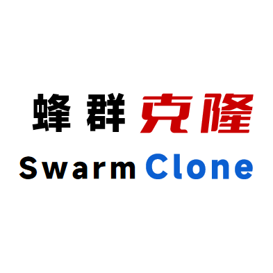

 
<a href="README.md">简体中文</a> | <strong>English</strong>
 
<h1>SwarmClone: Open-Source AI Virtual Streamer Ecosystem</h1>
<h3>🚀 Building Next-Generation AI-Powered Virtual Streaming Solutions</h3>

---

# Introduction

We are an open-source community dedicated to creating a **fully transparent, highly customizable** framework for AI virtual streamer development. Our solution provides developers and researchers with an end-to-end toolkit - from model training to live deployment - empowering anyone to build intelligent streamers capable of real-time interaction on platforms like Bilibili and Twitch.

### Core Value Proposition
| Feature | Capabilities | Developer Benefits |
|---------|--------------|---------------------|
| **🧱 Autonomous Architecture** | 100% open-source from core logic to application layer | Full control with zero black-box components |
| **🔄 Flexible Model Support** | Compatible with MiniLM2/ChatGPT/Claude models Local & API deployment options | Freedom to choose optimal AI engine |
| **🎮 Comprehensive Streaming** | Danmu interaction/Gift responses/Viewer mentions 20+ native streaming scenarios | Production-ready core functionality |
| **🧩 Modular Design** | Hot-swappable components Standardized interfaces | Customize your ideal streaming system |

---

### Our Mission
Through open collaboration, we aim to build:
- 🔓 **Transparent & Controllable** AI streaming stack
- 🌐 **Cross-Platform** streaming solutions
- 🧠 **Continuously Evolving** interaction capabilities

### Join Our Community

Explore the possibilities of AI-powered virtual streaming with developers worldwide!  
Whether you're a framework developer, model trainer, frontend/graphics engineer, UI/UX designer, or enthusiastic tester - if you're passionate about AI, virtual streaming, and open-source technology, SwarmClone welcomes your contribution! Let's build the next generation of open-source virtual streaming systems together!

👉 [GitHub Organization](https://github.com/SwarmClone) | 🐛 [Issue Tracker](https://github.com/SwarmClone/SwarmClone/issues) | 💬
[Developer QQ Group](https://qm.qq.com/q/aFEAE2I5X2)

---

# Technology Stack & Roadmap
1) Core LLM Development ([MiniLM2](https://github.com/swarmclone/MiniLM2)) *Completed*
2) Model Fine-tuning (Data: Modified COIG-CQIA etc.) *Stage Complete*
3) Virtual Avatar (Character setup: see `设定.txt`) *In Progress*
4) Streaming Display (Implementation: Unity-driven Live2D) *In Progress*
5) System Integration (Coordinating LLM, TTS, Avatar, STT) *In Progress*
6) Platform Integration (Bilibili/Twitch)
7) Advanced Features:
    - Long-term Memory (RAG)
    - Web-connected RAG
    - Active External Interaction (comments/DMs)
    - Multimodal Capabilities (visual/audio)
    - Special Effects & Animations
    - Singing Voice Synthesis
    - Game Integration (Minecraft, No Man's Sky)